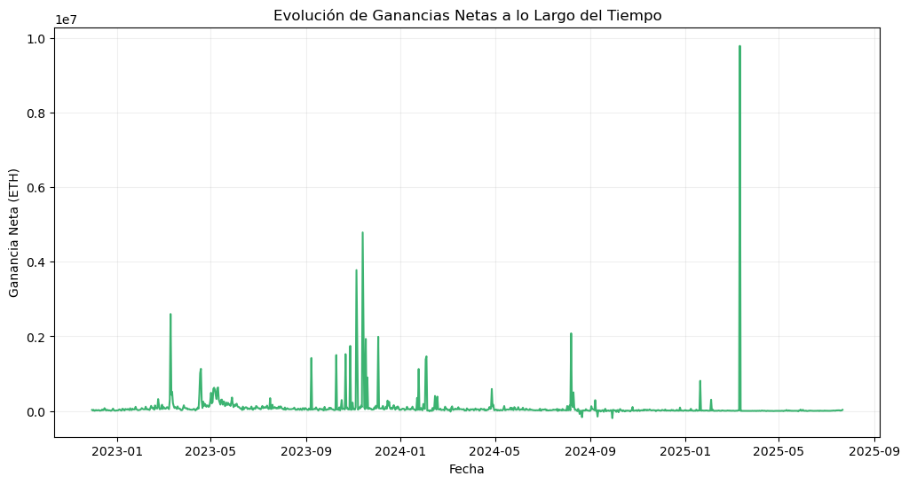
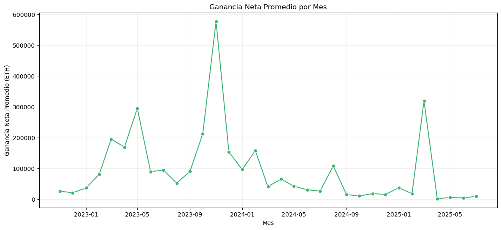
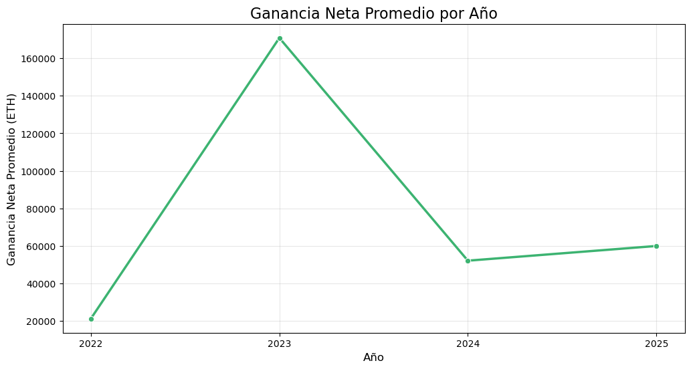
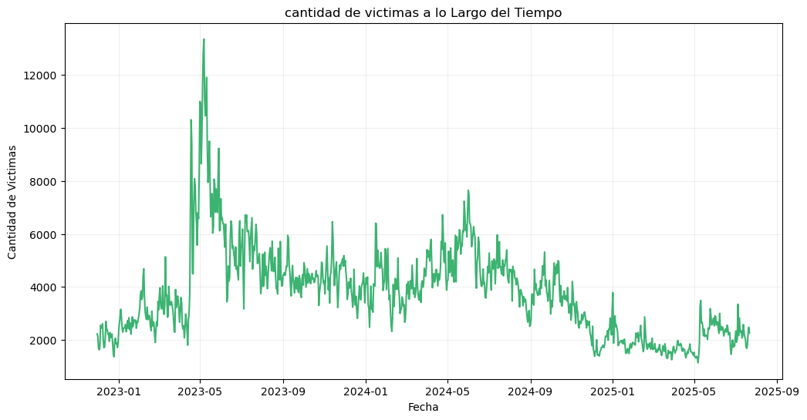
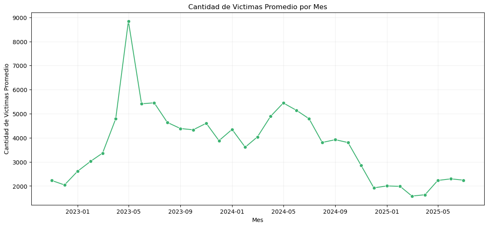
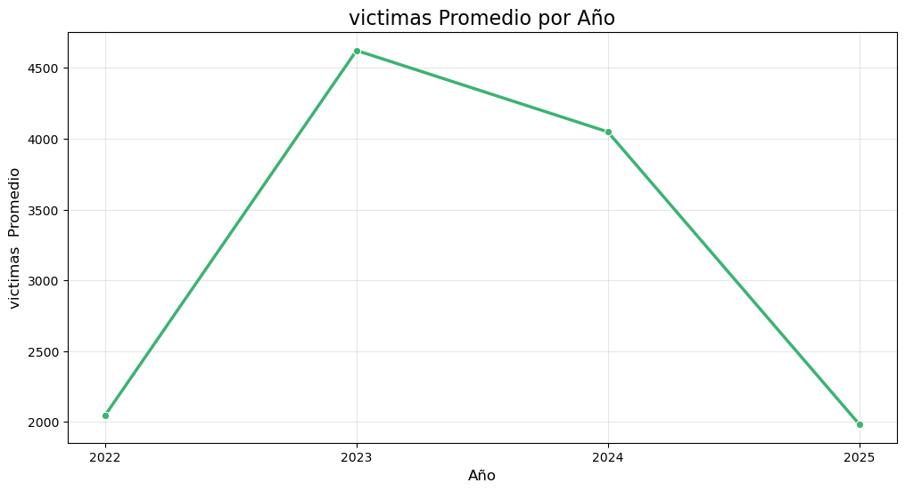

Los datos fueron recolectados desde la página de Eigenphi, esta entidad estructura los datos emitidos por el EtherScan en la red de Ethereum.
Los datos fueron descargados por medio de su platforma, tomé una muestra pequeña que recopila datos desde el **30 de septiembre del 2022 hasta el 22 de julio del 2025**, esta muestra cuenta con 955 registros que entraremos a ver más a detallle en el EDA (Exploratory Data Analysis).
Las variables que fueron posibles recolectar fueron:
## Variables del Dataset 

| **Variable**           | **Descripción**                                                                                                       |
| ---------------------- | ------------------------------------------------------------------------------------------------------------------------------------------ |
| **Sandwich Count**     | Número de ataques tipo *sandwich* detectados.                                                                                             |
| **Attackers (EOA)**    | Cuántas cuentas (de personas o bots) actuaron como atacantes.                                                                             |
| **Victims (EOA)**      | Cuántas cuentas fueron víctimas de ataques sandwich.                                                                                      |
| **Volume**             | Cantidad total de tokens que se movieron en estos ataques (en ETH ).                                                              |
| **Profit**             | Ganancia neta que obtuvieron los atacantes después de pagar costos.                                                                        |
| **Cost**               | Lo que les costó hacer el ataque (principalmente tarifas de gas).                                                                          |
| **Revenue**            | Ingresos totales antes de restar costos (dinero que entró sin contar gastos).                                                             |
| **ROI (%)**            | Qué tan rentable fue el ataque. Si el ROI es 200%, significa que ganaron el doble de lo que gastaron.                                      |
| **> 1k Tx Count**      | Número de ataques sandwich en los que se movió más de 1,000 tokens o ETH.                                                                   |
| **> 1k Volume**        | Volumen total de esos ataques grandes.                                                                                                      |
| **> 1k Profit**        | Ganancia de los ataques grandes (más de 1,000 tokens).                                                                                      |
| **> 1k Cost**          | Costo total de esos ataques grandes.                                                                                                        |
| **> 1k Revenue**       | Ingresos brutos de esos ataques grandes.                                                                                                     |
| **> 1k ROI (%)**       | Rentabilidad (ROI) de los ataques grandes.                                                                                                    |
| **Mev-Bot Tx Count**   | Número total de transacciones hechas por bots MEV.                                                                                             |
| **Mev-Bot Volume**     | Todo el volumen que movieron los bots (en ETH o tokens).                                                                                        |
| **Mev-Bot Profit**     | Ganancia total de todos los bots analizados.                                                                                                      |
| **Mev-Bot Cost**       | Lo que gastaron los bots en gas y tarifas.                                                                                                        |
| **Mev-Bot Revenue**    | Ingresos totales (antes de restar costos) de todos los bots.                                                                                     |
| **MEV ROI (%)**        | Qué tan rentable fue la operación global de los bots.                                                                                               |

---
# Vistas preliminares 

 1) Hay una alta actividad en los ataques de Sandwich demostrada **SOLO** en el periodo de los datos descargados, es decir desde el 30 de noviembre del 2023 hasta el 22 de julio del 2025 se han presentado en promedio **3.980** ataques sandwich, incluso **hay picos qeu superan los 13.000 ataques** 
 
 2) Concentración en pocos atacantes, realmente es un grupo reducido de bots afecta a miles de víctimas, en promedio **67 atacantes vs. 3,765 víctimas**
 3) ROI variable y sesgado: **mediana de 9.41% pero con máximos de 1412%**, lo que indica oportunidades excepcionales pero poco frecuentes. OJO También hay pérdidas (ROI mínimo -109%).
 4) Ganancias totales elevadas: **~94 millones de ETH acumulados**, lo que **confirma el impacto económico del MEV**. solo para hacernos una idea 
 **EN APROX 19 meses se han extraido casi 18.7 millones de COP(obvio con el cálculo a precio 2025) igual es un montón**

# Observaciones 
## Los ataques grandes (>1k) muestran un **ROI promedio altisimo**. Esto sugiere que, aunque son **menos frecuentes**, son **extremadamente rentables cuando ocurren**.

 En el ecosistema MEV, la mayoría de las ganancias proviene de ataques de gran volumen, y estos no solo generan más dinero en términos absolutos, sino que también son muchísimo más eficientes en términos de ROI. Esto implica que los bots más sofisticados, capaces de ejecutar estos ataques grandes, concentran la mayor parte del valor extraído.POR CHAT

## - Aunque los bots solo generaron ~16% del total de ganancias, logran una presencia significativa en la captura de valor del mercado.
## - El ROI de bots (24.89%) supera el ROI global (22%), evidenciando que los Bots aprovechan mejor cada unidad de capital (obvio La velocidad y automatización son ventajas competitivas claras.)
## - Bots: Orientados a precisión y rapidez, ejecutando operaciones rentables de forma consistente. Humanos: Orientados a escala, priorizando mayor volumen aunque con menos eficiencia.
## - El menor ROI global sugiere que los bots capturan las oportunidades más rentables primero, dejando a los humanos escenarios menos atractivos. **obvio**

# **Es por eso que la creciente abarcación de los bots en este mercado sugiere necesidad de regulación en los protocolos dentro de la red!!!!**

---

muy poquitas en perdidas, entre enero y mayo hubo una extracción estrámbotica, lo atribuyo a tambien el avance en los validadores que hubo recientemente, pudo haber puesto tecnología disponible para extraer eso

---

Resalta diciembre...

---

Acá cabe resaltar que del año 2022 solo se recolectó información de diciembre, por lo tanto no es directamente comparable ese año en esta gráfica, al igual que el 2025(por obvias razones)

---

---

---

